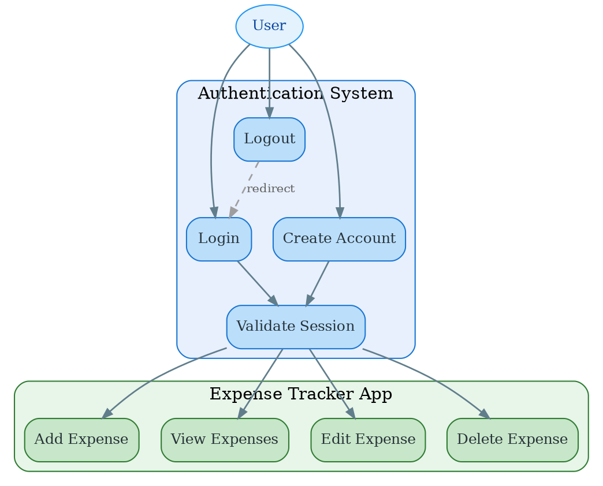
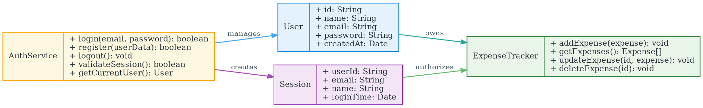
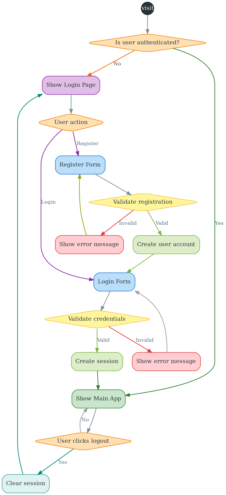
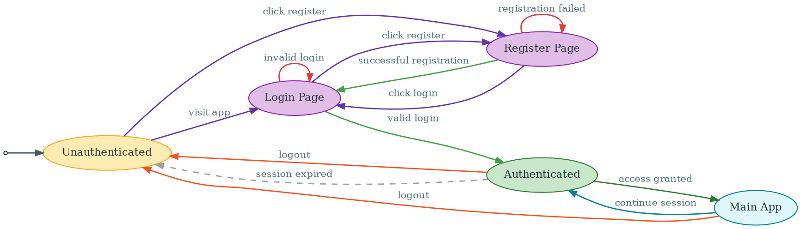
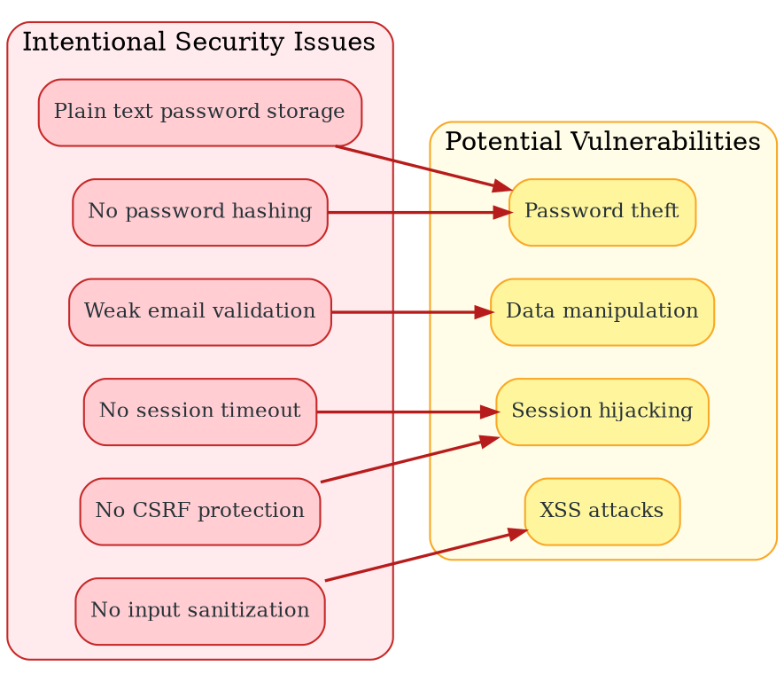

# Authentication System Diagrams

This document contains all the authentication-related diagrams for the Expense Tracker application.

## 1. Authentication Use Case Diagram (Graphviz)

## 2. Authentication Class Diagram (Graphviz)

## 3. Authentication Flow Diagram (Graphviz)

## 4. Authentication State Diagram (Graphviz)

## 5. Authentication Sequence Diagram (Graphviz)

```dot
digraph Sequence {
  // Layout
  rankdir=LR;
  graph [bgcolor="white", ranksep="1.8", nodesep="1.2", pad="0.6", dpi="150", splines=ortho, labelloc=t, fontsize=12];
  node [shape=plaintext, fontsize=11, fontcolor="#263238"];
  edge [color="#78909C", arrowsize=0.9, penwidth=1.4, fontcolor="#455A64", fontsize=10, minlen=2];

  // Participants
  U [label=<
    <TABLE BORDER="0" CELLBORDER="1" CELLSPACING="0" COLOR="#1E88E5">
      <TR><TD BGCOLOR="#E3F2FD" WIDTH="140" ALIGN="CENTER"><B>User</B></TD></TR>
    </TABLE>
  >];
  L [label=<
    <TABLE BORDER="0" CELLBORDER="1" CELLSPACING="0" COLOR="#8E24AA">
      <TR><TD BGCOLOR="#F3E5F5" WIDTH="180" ALIGN="CENTER"><B>Login Page</B></TD></TR>
    </TABLE>
  >];
  A [label=<
    <TABLE BORDER="0" CELLBORDER="1" CELLSPACING="0" COLOR="#FFA000">
      <TR><TD BGCOLOR="#FFF8E1" WIDTH="180" ALIGN="CENTER"><B>Auth Service</B></TD></TR>
    </TABLE>
  >];
  S [label=<
    <TABLE BORDER="0" CELLBORDER="1" CELLSPACING="0" COLOR="#00897B">
      <TR><TD BGCOLOR="#E0F2F1" WIDTH="200" ALIGN="CENTER"><B>Session Storage</B></TD></TR>
    </TABLE>
  >];
  M [label=<
    <TABLE BORDER="0" CELLBORDER="1" CELLSPACING="0" COLOR="#2E7D32">
      <TR><TD BGCOLOR="#E8F5E9" WIDTH="160" ALIGN="CENTER"><B>Main App</B></TD></TR>
    </TABLE>
  >];

  {rank=same; U; L; A; S; M}

  // Strong spacing between columns
  U -> L [style=invis, weight=30];
  L -> A [style=invis, weight=30];
  A -> S [style=invis, weight=30];
  S -> M [style=invis, weight=30];

  // Visit & auth check
  U -> L [label="Visit app", color="#1E88E5"];
  L -> A [label="Check authentication", color="#8E24AA"];
  A -> S [label="Get session data", color="#FFA000"];
  S -> A [label="No session", style=dashed, color="#00897B", constraint=false];
  A -> L [label="Not authenticated", style=dashed, color="#FFA000", constraint=false];
  L -> U [label="Show login form", style=dashed, color="#8E24AA", constraint=false];

  // Login
  U -> L [label="Enter credentials", color="#1E88E5"];
  L -> A [label="Validate login", color="#8E24AA"];
  A -> S [label="Check user data", color="#FFA000"];
  S -> A [label="User found", style=dashed, color="#00897B", constraint=false];
  A -> S [label="Create session", color="#FFA000"];
  A -> L [label="Login successful", style=dashed, color="#43A047", constraint=false];
  L -> M [label="Redirect to main app", style=dashed, color="#2E7D32", constraint=false];

  // Authenticated usage
  U -> M [label="Use app features", color="#2E7D32"];
  M -> A [label="Validate session", color="#00838F"];
  A -> S [label="Check session", color="#FFA000"];
  S -> A [label="Session valid", style=dashed, color="#00897B", constraint=false];
  A -> M [label="User authenticated", style=dashed, color="#2E7D32", constraint=false];
  M -> U [label="Show protected content", style=dashed, color="#1E88E5", constraint=false];

  // Logout
  U -> M [label="Logout", color="#EF5350"];
  M -> A [label="Clear session", color="#00897B"];
  A -> S [label="Remove session", color="#FFA000"];
  A -> M [label="Logout complete", style=dashed, color="#43A047", constraint=false];
  M -> L [label="Redirect to login", style=dashed, color="#8E24AA", constraint=false];
}
```

## 6. Security Issues Diagram (Graphviz)

## Code Changes for Authentication Testing

The following intentional authentication issues have been introduced for testing purposes:

### Issues Added:

1. **Password Security Issue**: Passwords are stored in plain text without hashing
2. **Email Validation Issue**: Email format validation is missing or weakened
3. **Session Security Issue**: No session timeout or proper session management
4. **Input Validation Issue**: No proper input sanitization for user data
5. **Authentication Bypass Issue**: Weak authentication checks

### Files Modified:
- `login.html` - Authentication interface
- `auth.js` - Authentication logic with intentional security gaps
- `app.js` - Main app with authentication requirements
- `styles.css` - Authentication page styling

### Testing Scenarios:
- Test with weak passwords
- Test with invalid email formats
- Test session persistence
- Test authentication bypass attempts
- Test input injection attacks

These issues are marked with comments in the code and should be fixed during security testing phases.
